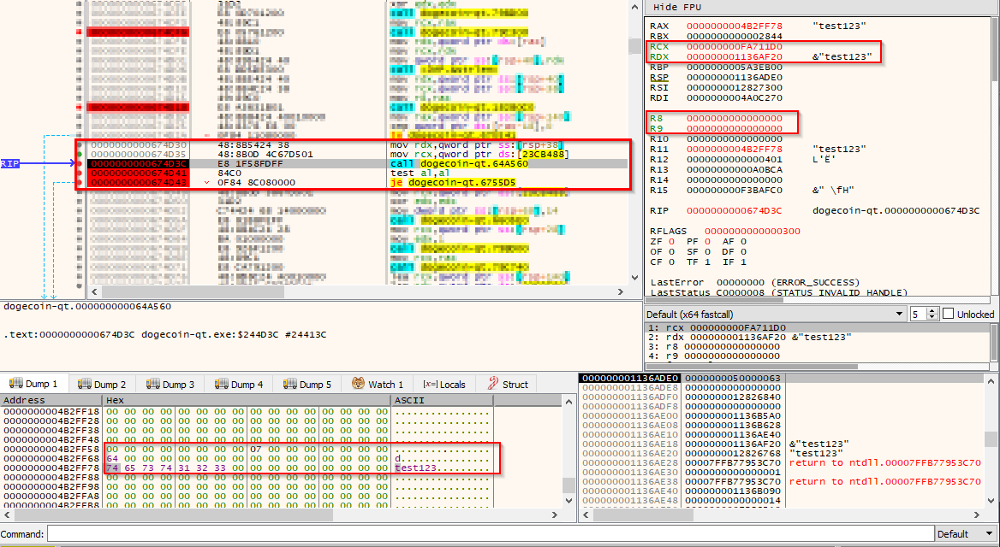
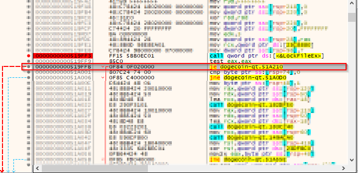
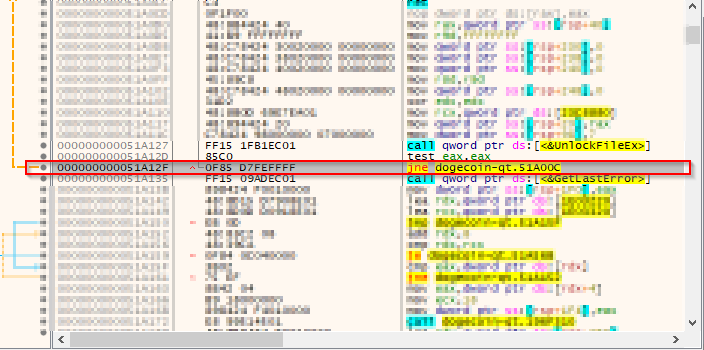
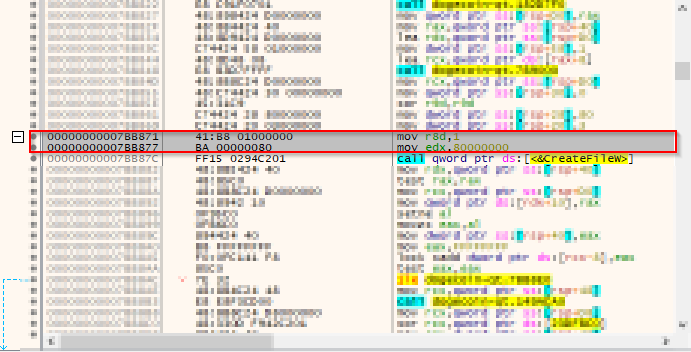
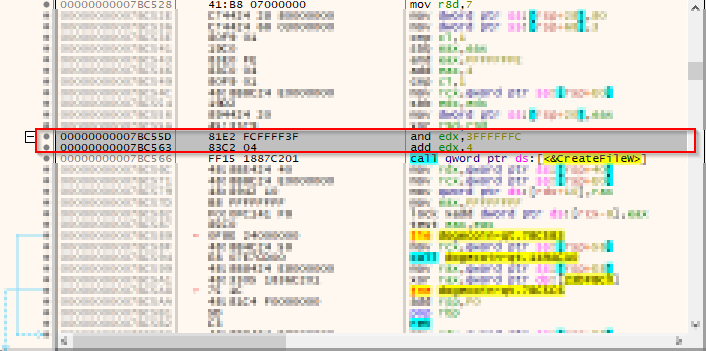

# About

This tool is designed for DogeCoin Core v1.14.2 (64bit) on Windows. It reads from one or more password lists and attempts to unlock a dogecoin wallet. GPU acceleration is not supported. It can be used in single or multi processor mode.

# Compilation

This tool was compiled with gcc (x64).

```
gcc -shared -o agent.dll agent.c
gcc -o injector.exe injector.c
gcc -o controller.exe controller.c
gcc -o patcher.exe patcher.c
```

# Instructions

## Prerequisities

You will need to allow Write permissions for the Dogecoin folder (likely path is C:\\Program Files\\Dogecoin)

The Dogecoin wallet installer should match one of the following hashes:

```
MD5: 96e508b44dc99be34e4c8b56dc2920b7
SHA256: dc8cd7efd1318b293c473fbe4ab5aac994e78b9e379aa03fb166cee352f06e28
```

The dogecoin-qt.exe should match one of the following hashes:

```
MD5: 7d33cfa6e6fd9763488ce13d28d10bdc
SHA256: 6481a66f441901e5f841017ed74fb1b6a30df8ef23e62a439c837b1706578414
```

## Steps

1. Copy controller.exe, injector.exe, patcher.exe and agent.dll into the same folder as dogecoin-qt.exe
2. Launch CMD in this same folder, and run the following command: ```patcher.exe```
3. This will create a new .exe called "dogecoin-qt-patched.exe"
4. In this same folder, create a unique password list file for each worker to use. If you want two workers, then create the following files: "candidate_list_0.txt", "candidate_list_1.txt".
    * If you currently have one large password list file, you will have to split it up according to the amount of workers you want.
    * The amount of workers should not exceed the cores on your CPU.
5. Using CMD again, run the following command: ```controller.exe 2```
    * The "2" specifies the amount of workers to run.
6. Wait for results - output files are written to the user's Desktop.

# How it works

The following describes the steps this tool takes to unlock a dogecoin wallet.

1. The dogecoin-qt.exe is launched by the tool
2. The tool injects a DLL into dogecoin-qt.exe
3. The DLL reads the password list file, line by line
4. The DLL calls a function inside dogecoin-qt.exe which checks if the supplied passphrase is correct
5. The DLL writes the result of the function call to a shared memory location
6. The DLL also writes to disk with the final result when the passphrase has been discovered or the list has been exhausted
7. The DLL stops looping once it has succeeded or exhausted the password list file.
8. The tool periodically reads the shared memory to check if the passphrase has successfully been discovered
9. The tool reports if there has been a success or if the list has been exhausted, and in the case of multiprocesssing, it specifies which instance has succeeded or failed. The user is told to read the associated output file for that instance for more info.

In multiprocessing, the tool launches multiple instances of dogecoin-qt.exe, and injects a DLL into each instance. Each DLL will expect its own password list file to read from. From then on, the steps above are largely the same. The tool will monitor each DLL and await a successful result (in which case all other instances are shut down), or wait until all instances have failed.


# Discovery Info

## dogecoin-qt.exe function

The passphrase check function was discovered with dynamic analysis using x64dbg. dogecoin-qt.exe has a console window which allows a user to perform a variety of commands, some of which can be performed in the GUI as well. One of these commands is "**walletpassphrase (password_here) 1**". An incorrect password results in the error: "**Error: The wallet passphrase entered was incorrect. (code -14)**". Using x64dbg, it was possible to set a breakpoint on this string, and then refer to the callstack to determine what lead to this string being used. Further analysis showed what arguments the function required:

1. An arbitrary value which found at a constant offset
2. A double pointer to a struct of the form:

```c
typedef struct _PasssphraseObject
{
    long long passphraseLength;
    char padding[0x10];
    char passphrase[64];
} PassphraseObject;
``` 

NOTE: In the screenshot below, the number 64 is seen in the struct - this function does not care about that value, but it is related to the fact that the max length of the passphrase is 64. Supplying a passphrase beyond 64 characters creates a new type of struct which I have not designed this tool for.

3. A value of 0.
4. A value of 0.

The function returns a 0 for failure or 1 for success. 

(In normal usage of the dogecoin-qt.exe software, if the function returns a 0, the "je" instruction will jump to the error string)



## dogecoin-qt.exe patching

By default, only one instance of dogecoin-qt.exe is allowed to run. Any attempt to launch more instances results in those instances throwing errors and closing. This is due to a lock file which subsequent instances try to acquire. The patcher tool changes some assembly instructions such that the lock files are sharable to any process, and if there any errors following an attempt to acquire a lock, they are ignored.

The patcher tool has comments indicating which bytes are for which "region". The screenshots below clarify what these regions are.

### Region 1 - Bypass Lock Error

|  |
| :---: |
| The conditional jump "je" is removed (filled with nops). This stops any error related code from running. |

### Region 2 - Bypass Unlock Error

|  |
| :---: |
| The conditional jump "jne" is changed to a forced jmp. This stops any error related code from running. |

### Region 3 - Modify CreateFile call

|  |
| :---: |
| dwDesiredAccess (edx) is changed to 0xC0000000 and dwShareMode (r8d) is changed to 0x07. This creates the file in Read & Write modes (dwDesiredAccess), and allows any process to do so (dwShareMode).


### Region 4 - Modify CreateFile call

|  |
| :---: |
| dwDesiredAccess (edx) is changed to 0xC0000000. r8d is set to 0x07 already.